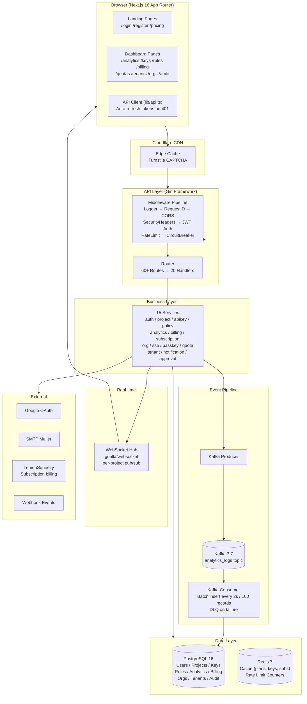
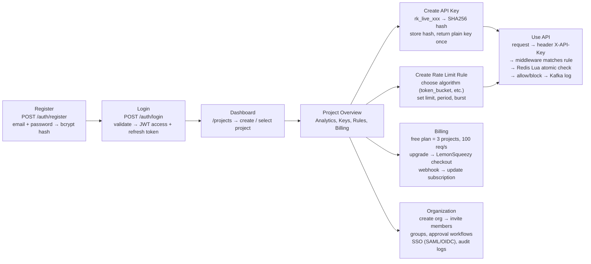
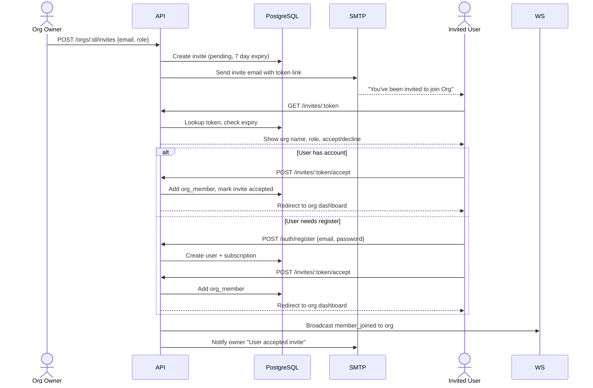
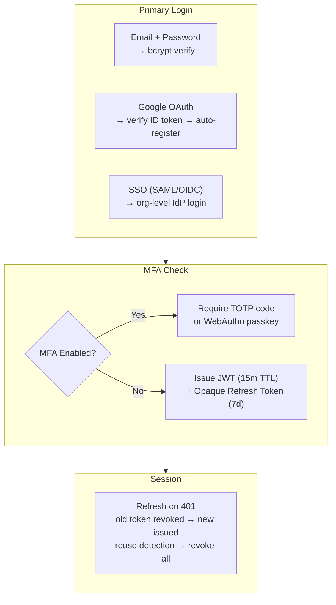
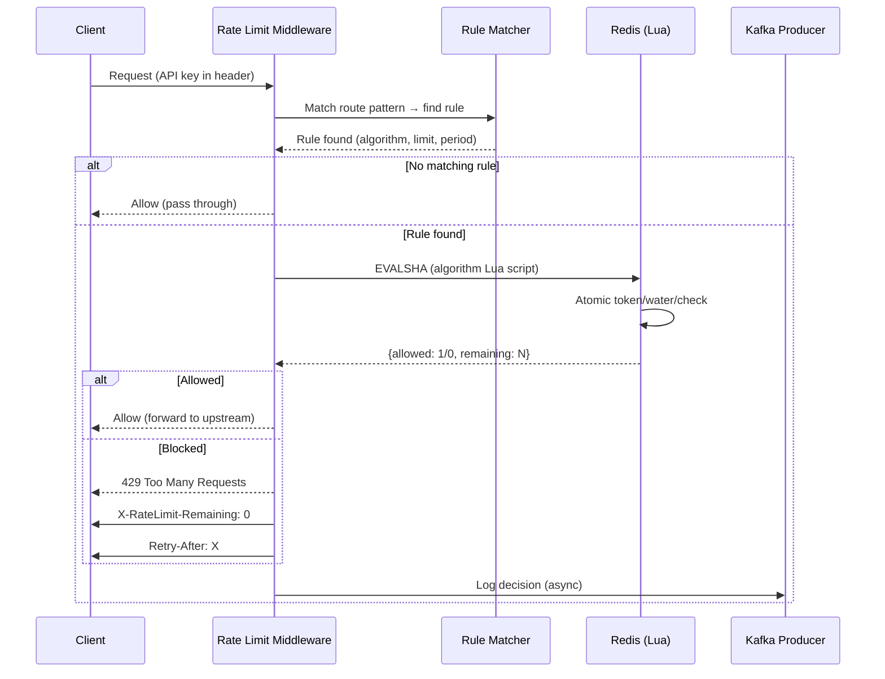

# Architecture & Data Flow

## System Architecture

## User Journey Flow

## Invite Flow

## Auth Security Flow

## Rate Limit Decision Flow

## Tech Stack

| Component | Technology |
|---|---|
| Frontend | Next.js 16, TypeScript, Tailwind, shadcn, Framer Motion |
| Backend | Go 1.25, Gin, GORM, gorilla/websocket |
| Database | PostgreSQL 16 |
| Cache | Redis 7 (rate limit Lua scripts) |
| Queue | Kafka 3.7 + DLQ |
| Auth | JWT + bcrypt + TOTP + WebAuthn |
| Monitoring | Prometheus + OpenTelemetry |
| Deployment | Docker Compose / Kubernetes |
| CDN | Cloudflare (Turnstile, caching) |
