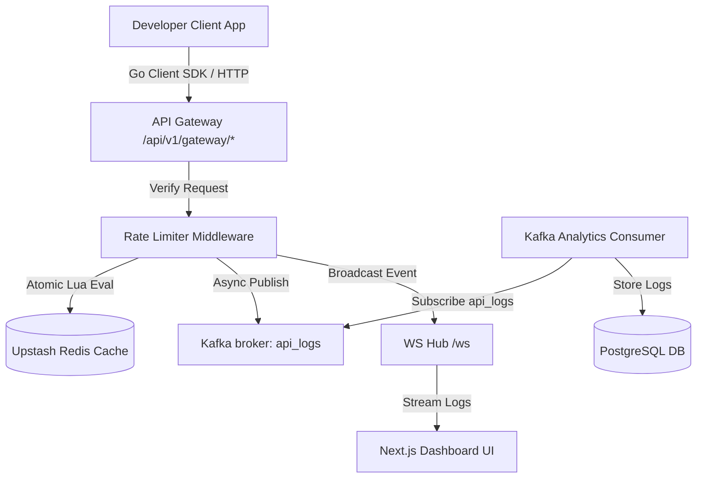

# Limiter.io - Technical Architecture & Developer Context

This document provides complete operational, architectural, and codebase context for **Limiter.io**—a multi-tenant distributed rate-limiting platform.

---

## 🏛️ System Architecture



### 1. Services
- **API Server (`cmd/api/main.go`)**: Houses user registration, key creation, project isolation, WebSocket stream endpoints, and the gateway reverse proxy rate-limiting checks.
- **Consumer (`cmd/consumer/main.go`)**: Reads batch requests logs from Apache Kafka asynchronously, writing events to Postgres.
- **Go SDK (`sdk/client.go`)**: Importable client library with middleware for developers to secure standard Go/Gin servers.

---

## 💾 Core Databases & Schemas

### 1. PostgreSQL (Neon / Local)
- **User / Subscription**: Maps subscribers to `free`, `pro`, or `enterprise` plans.
- **Project**: Groups API keys and rate rules.
- **APIKey**: SHA-256 hashed keys for client validation.
- **RateLimitRule**: Target-specific route paths, algorithms, limit quotas, period windows, and burst rules.
- **AnalyticsLog**: Long-term request log records.

### 2. Upstash Redis (Global Edge Cache)
- Core rate-limiting rules are evaluated atomically inside Redis using optimized **Lua Scripts** to prevent race conditions.
- Available algorithms:
  - **Token Bucket**: Refills tokens at a set frequency, accommodating temporary traffic bursts.
  - **Fixed Window**: Tracks exact counter resets relative to standard epoch times.
  - **Sliding Window Counter**: Estimates current rates by mixing the previous and current window tallies.
  - **Sliding Window Log**: Precise request timestamp logs (highest accuracy, higher memory consumption).
  - **Leaky Bucket**: Queues and drips outgoing requests at a smooth constant interval.

---

## 💳 Billing Webhooks (Lemon Squeezy Integration)
- **Endpoint**: `POST /api/v1/billing/webhook`
- **Security**: Verifies `X-Signature` using a pre-shared HMAC-SHA256 signature key.
- **Flow**:
  1. Captures `subscription_created` events.
  2. Identifies user email and confirms transaction Variant ID `1899978`.
  3. Upgrades user plan to `pro` inside Postgres database and invalidates the Redis subscription cache entry to enforce upgraded rates instantly.

---

## 🛠️ SDK Usage
Developers import `limiter.io/sdk` to check rate limits inside standard Gin routes:
```go
import "limiter.io/sdk"

client := sdk.NewClient("http://localhost:8080", "developer_api_key")
r := gin.Default()
r.Use(sdk.GinRateLimit(client))
```
**Fail-Open Safety**: If the rate limiting gateway is unavailable, the SDK fails open, logging the incident without blocking client application traffic.
