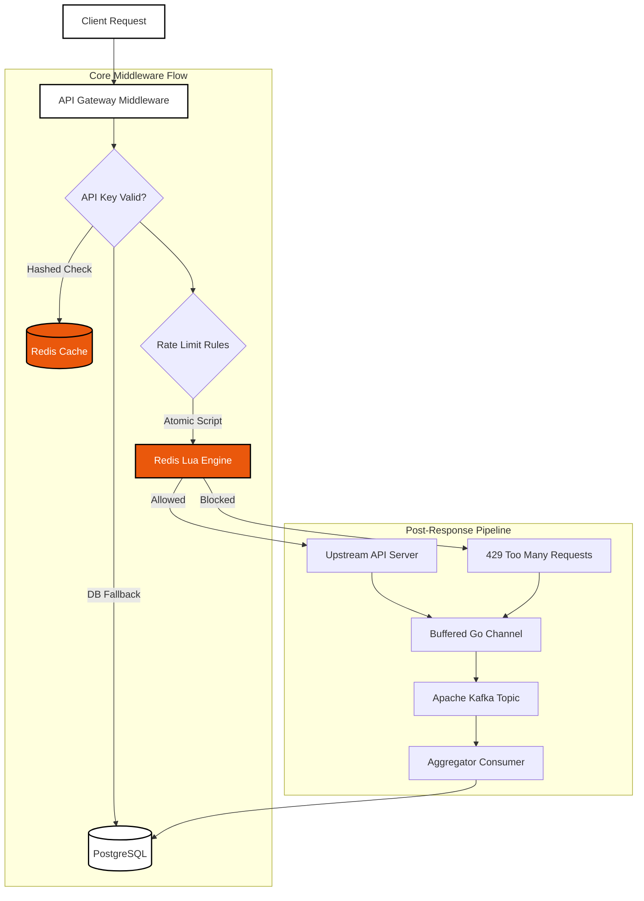
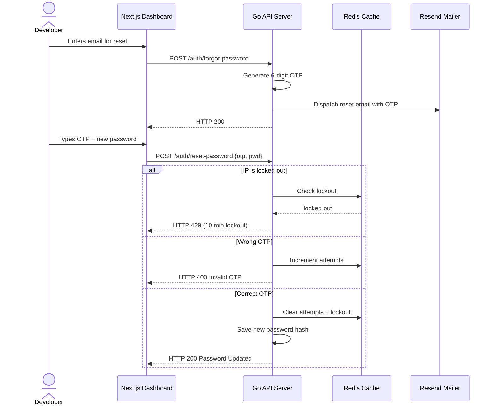

# Limiter.io — Distributed API Rate Limiting Platform

<div align="center">

[](https://go.dev)
[](https://nextjs.org)
[](https://www.typescriptlang.org)
[](https://www.postgresql.org)
[](https://redis.io)
[](https://kafka.apache.org)
[](https://docker.com)
[](https://kubernetes.io)
[](https://opentelemetry.io)
[](https://gin-gonic.com)
[](https://gorm.io)
[](https://workers.cloudflare.com)
[](https://github.com)

**A production-grade, highly scalable distributed API Rate Limiting Platform** built in Go and Next.js. Inspired by Cloudflare Rate Limiting and Upstash. Enforces fine-grained API throttling at sub-millisecond speeds.

</div>

---

## Table of Contents

- [System Architecture](#system-architecture)
- [Features](#features)
- [Tech Stack](#tech-stack)
- [Repository Structure](#repository-structure)
- [Quick Start](#quick-start)
- [API Reference](#api-reference)
- [Rate Limiting Algorithms](#rate-limiting-algorithms)
- [Subscription Plans](#subscription-plans)
- [Authentication & Security](#authentication--security)
- [Deployment](#deployment)
- [Monitoring](#monitoring)

---

## System Architecture



The platform uses a multi-layer architecture:

- **API Gateway** — Gin-based middleware that validates API keys, evaluates rate limit rules, and executes Redis Lua scripts for atomic counter operations.
- **Redis Cache** — Preloaded Lua scripts for token bucket, fixed window, sliding window counter/log, and leaky bucket algorithms. API key lookups and rate limit counters live here.
- **PostgreSQL** — Persistent storage for projects, keys, rules, analytics, users, organizations, billing, and configuration.
- **Kafka** — Async analytics pipeline. Every request decision (allowed/blocked) is published to Kafka, consumed by a background aggregator, and written to PostgreSQL.
- **OpenTelemetry** — Distributed tracing across the request lifecycle with OTLP export.

---

## Features

### Rate Limiting

- 5 algorithmic engines — Token Bucket, Fixed Window, Sliding Window Counter, Sliding Window Log, Leaky Bucket
- Sub-millisecond decision making via Redis Lua scripts
- Per-route and per-key rate limit rules
- Weighted requests (different costs for different endpoints)
- Per-customer tenant overrides
- Multi-window quotas (per minute / hour / day / month)
- Dry-run mode to test rules without enforcement

### Team Collaboration

- Organizations with role-based access (owner, admin, member)
- Organization groups for bulk permission management
- Multi-approver approval workflows for sensitive changes (policy changes, key rotations)
- Project-level member management with granular roles
- Notification preferences (email, Slack, rate limit alerts, weekly digest)

### Enterprise Security

- JWT authentication with access/refresh token rotation
- WebAuthn / Passkey support for passwordless login
- SAML 2.0 and OpenID Connect SSO
- SCIM provisioning stubs
- Immutable audit logs with SHA-256 hash chain verification
- IP access control rules (allow/block lists)
- Brute-force guard with automatic IP lockout
- Cloudflare Turnstile CAPTCHA integration
- Emergency blocking middleware
- Maintenance mode

### Analytics & Observability

- Real-time request analytics with time-series data
- P95 and P99 latency percentiles
- Top routes and API keys breakdown
- Saved analytics views
- Anomaly detection with configurable sensitivity
- Slack alerts for traffic anomalies
- Prometheus metrics
- OpenTelemetry distributed tracing
- Structured JSON logging via Zap
- Request export (CSV / JSON)

### Billing & Subscription

- Multi-tier subscription plans (Free, Pro, Enterprise)
- Lemon Squeezy payment integration
- Usage-based billing records
- Invoice generation and tracking
- SLA configuration (uptime %, P99 response time, support level)
- White-label email templates
- Multi-region gateway configuration

### Developer Experience

- CLI tool for project and key management
- OpenAPI / Swagger specification
- Integration snippets for curl, Python, Go, Node.js, Ruby
- Sandbox environment with auto-provisioned projects
- Edge rate limiter Cloudflare Worker
- k6 load testing scripts
- Chaos testing suite

---

## Tech Stack

| Layer | Technology |
|---|---|
| **Backend** | Go 1.25, Gin, GORM, Viper, Zap |
| **Frontend** | Next.js 16, TypeScript, Tailwind CSS, Framer Motion, TanStack Table |
| **Database** | PostgreSQL 16 |
| **Cache** | Redis 7 (Lua scripting) |
| **Message Queue** | Apache Kafka 3.7 |
| **Auth** | JWT, WebAuthn, SAML 2.0, OIDC |
| **Observability** | OpenTelemetry, Prometheus |
| **Infrastructure** | Docker, Kubernetes, Docker Compose |
| **Edge** | Cloudflare Workers |
| **Billing** | Lemon Squeezy |
| **Email** | Resend |

---

## Repository Structure

```text
├── cmd/
│   ├── api/              # API Server entrypoint
│   ├── consumer/         # Kafka background aggregator consumer
│   └── cli/              # CLI tool for project management
├── internal/
│   ├── config/           # Environment configuration (Viper)
│   ├── database/         # PostgreSQL connection, migrations, seeding
│   ├── delivery/http/    # Gin router initialization
│   ├── dto/              # Data Transfer Objects
│   ├── handlers/         # HTTP controllers
│   ├── kafka/            # Producer, consumer, dead letter queue
│   ├── mailer/           # Resend transactional email client
│   ├── middleware/       # Auth, rate limiting, maintenance, circuit breaker
│   ├── models/           # GORM database schemas
│   ├── otel/             # OpenTelemetry tracing setup
│   ├── ratelimiter/      # Rate limiter interface + Redis implementations
│   ├── redis/            # Redis connection pool + Lua scripts
│   ├── repository/       # Repository interfaces (GORM + Redis)
│   ├── services/         # Business logic layer
│   ├── sso/              # SAML / OIDC / SCIM support
│   └── utils/            # Crypto, OTP, helpers
├── deploy/
│   ├── docker/           # Dockerfile + Docker Compose stack
│   ├── kubernetes/       # K8s manifests (deployments, services, HPA, ConfigMap)
│   ├── k6/               # Load testing scripts
│   └── chaos/            # Chaos testing suite
├── docs/                 # Documentation (backups, deployment, scaling, regional)
├── landing/              # Next.js 16 brutalist dashboard
├── sdk/                  # OpenAPI spec, integration snippets
├── workers/              # Cloudflare edge rate limiter
└── .github/              # CI workflows (lint, scan, test)
```

---

## Quick Start

### Prerequisites

- Go 1.25+
- Docker & Docker Compose
- Node.js 22+

### 1. Environment Configuration

```bash
cp .env.example .env
```

Configure required keys in `.env`:
```env
NEXT_PUBLIC_TURNSTILE_SITE_KEY=your_turnstile_site_key
TURNSTILE_SECRET_KEY=your_turnstile_secret_key
RESEND_API_KEY=your_resend_api_key
```

### 2. Launch Infrastructure

```bash
docker-compose -f deploy/docker/docker-compose.yml up --build -d
```

### 3. Access Services

| Service | URL |
|---|---|
| Next.js Dashboard | http://localhost:3000 |
| Go API Server | http://localhost:8080 |
| Swagger API Docs | http://localhost:8080/swagger/index.html |
| Prometheus Metrics | http://localhost:9090 |
| Health Check | http://localhost:8080/healthz |
| Readiness Probe | http://localhost:8080/readyz |

---

## API Reference

### Authentication

| Method | Route | Description | Auth |
|---|---|---|---|
| POST | `/api/v1/auth/register` | Register operator profile | No |
| POST | `/api/v1/auth/login` | Authenticate and issue JWT tokens | No |
| POST | `/api/v1/auth/forgot-password` | Send 6-digit OTP reset code | No |
| POST | `/api/v1/auth/reset-password` | Validate OTP and set new password | No |
| POST | `/api/v1/auth/logout` | Revoke user access and refresh tokens | Yes |
| POST | `/api/v1/auth/refresh` | Refresh access token | Refresh |
| POST | `/api/v1/auth/passkeys/register/begin` | Begin WebAuthn registration | Yes |
| POST | `/api/v1/auth/passkeys/register/complete` | Complete WebAuthn registration | Yes |
| POST | `/api/v1/auth/passkeys/login/begin` | Begin WebAuthn login | No |
| POST | `/api/v1/auth/passkeys/login/complete` | Complete WebAuthn login | No |
| GET | `/api/v1/auth/passkeys` | List registered passkeys | Yes |
| DELETE | `/api/v1/auth/passkeys/:id` | Delete a passkey | Yes |

### Projects & Keys

| Method | Route | Description | Auth |
|---|---|---|---|
| POST | `/api/v1/projects` | Create new project | Yes |
| GET | `/api/v1/projects` | List projects | Yes |
| GET | `/api/v1/projects/:id` | Get project details | Yes |
| PUT | `/api/v1/projects/:id` | Update project | Yes |
| DELETE | `/api/v1/projects/:id` | Delete project | Yes |
| POST | `/api/v1/projects/:id/keys` | Create API key | Yes |
| GET | `/api/v1/projects/:id/keys` | List API keys | Yes |
| DELETE | `/api/v1/projects/:id/keys/:keyId` | Revoke API key | Yes |

### Rate Limit Rules

| Method | Route | Description | Auth |
|---|---|---|---|
| POST | `/api/v1/projects/:id/rules` | Create rate limit rule | Yes |
| GET | `/api/v1/projects/:id/rules` | List rules | Yes |
| PUT | `/api/v1/projects/:id/rules/:ruleId` | Update rule | Yes |
| DELETE | `/api/v1/projects/:id/rules/:ruleId` | Delete rule | Yes |
| POST | `/api/v1/projects/:id/rules/test` | Test rule in dry-run mode | Yes |

### Analytics

| Method | Route | Description | Auth |
|---|---|---|---|
| GET | `/api/v1/projects/:id/analytics/stats` | Aggregate request stats | Yes |
| GET | `/api/v1/projects/:id/analytics/timeseries` | Time-series request data | Yes |
| GET | `/api/v1/projects/:id/analytics/logs` | Raw analytics logs | Yes |
| GET | `/api/v1/projects/:id/analytics/export` | Export analytics (CSV/JSON) | Yes |
| GET | `/api/v1/projects/:id/analytics/data` | Full analytics data with P95/P99 | Yes |
| POST | `/api/v1/projects/:id/analytics/views` | Save analytics view | Yes |
| GET | `/api/v1/projects/:id/analytics/views` | List saved views | Yes |
| GET | `/api/v1/projects/:id/analytics/anomaly-config` | Get anomaly detection config | Yes |
| PUT | `/api/v1/projects/:id/analytics/anomaly-config` | Update anomaly detection | Yes |

### Organizations

| Method | Route | Description | Auth |
|---|---|---|---|
| POST | `/api/v1/organizations` | Create organization | Yes |
| GET | `/api/v1/organizations` | List user's organizations | Yes |
| GET | `/api/v1/organizations/:id` | Get organization | Yes |
| POST | `/api/v1/organizations/:id/members` | Add member | Yes |
| GET | `/api/v1/organizations/:id/members` | List members | Yes |
| DELETE | `/api/v1/organizations/:id/members/:userId` | Remove member | Yes |
| POST | `/api/v1/organizations/:id/groups` | Create group | Yes |
| GET | `/api/v1/organizations/:id/groups` | List groups | Yes |
| DELETE | `/api/v1/organizations/:id/groups/:groupId` | Delete group | Yes |

### Billing & Enterprise

| Method | Route | Description | Auth |
|---|---|---|---|
| GET | `/api/v1/subscription` | Get current subscription | Yes |
| GET | `/api/v1/projects/:id/invoices` | List invoices | Yes |
| GET | `/api/v1/projects/:id/usage` | Get usage records | Yes |
| GET | `/api/v1/organizations/:id/sla-config` | Get SLA config | Yes |
| PUT | `/api/v1/organizations/:id/sla-config` | Update SLA config | Yes |
| GET | `/api/v1/organizations/:id/sso/saml` | Get SAML config | Yes |
| POST | `/api/v1/organizations/:id/sso/saml` | Set SAML config | Yes |
| GET | `/api/v1/organizations/:id/sso/oidc` | Get OIDC config | Yes |
| POST | `/api/v1/organizations/:id/sso/oidc` | Set OIDC config | Yes |

### Audit & Security

| Method | Route | Description | Auth |
|---|---|---|---|
| GET | `/api/v1/audit-logs` | List immutable audit logs | Yes |
| GET | `/api/v1/audit-logs/verify-chain` | Verify audit log hash chain | Yes |
| GET | `/api/v1/projects/:id/ip-rules` | List IP access rules | Yes |
| POST | `/api/v1/projects/:id/ip-rules` | Create IP rule | Yes |
| DELETE | `/api/v1/projects/:id/ip-rules/:ruleId` | Delete IP rule | Yes |

### System

| Method | Route | Description | Auth |
|---|---|---|---|
| GET | `/status` | System status (DB, goroutines, memory) | No |
| GET | `/health` | Health check endpoint | No |
| GET | `/api/v1/maintenance` | Get maintenance mode status | Yes |
| POST | `/api/v1/sandbox/create` | Create sandbox project | Yes |

---

## Rate Limiting Algorithms

### Token Bucket

The most popular algorithm. Tokens are added at a fixed rate (refill rate) up to a maximum capacity. Each request consumes one token. Bursts are absorbed up to the bucket capacity, then requests are throttled. Ideal for APIs that need to handle traffic spikes gracefully.

### Fixed Window

Counts requests in fixed time windows (e.g., per minute). Simple and memory-efficient but can cause traffic spikes at window boundaries. Best for simple use cases where occasional bursts at boundaries are acceptable.

### Sliding Window Counter

Blends the current and previous window counts using a weighted average based on the elapsed time in the current window. Smooths out the boundary spikes of fixed window while maintaining low memory overhead. Good general-purpose algorithm.

### Sliding Window Log

Maintains a sorted set of timestamps for each request. Provides the most accurate rate limiting as it considers the exact time of each request. Higher memory usage. Use when precision is critical.

### Leaky Bucket

Requests enter a queue (bucket) and are processed at a constant rate. If the queue is full, the request is rejected. Ensures a steady outflow regardless of input spikes. Perfect for downstream services that can't handle bursts.

---

## Subscription Plans

| Feature | Free | Pro | Enterprise |
|---|---|---|---|
| Max Projects | 3 | Unlimited | Unlimited |
| Max Keys per Project | 3 | Unlimited | Unlimited |
| Algorithms | Token Bucket | All 5 algorithms | All 5 algorithms |
| Analytics Retention | 7 Days | 90 Days | 365 Days |
| Rate Limit | 100/min | 10,000/min | 1,000,000/min |
| SLA | None | 99.9% uptime, P99 < 200ms | Custom SLA |
| SSO | No | No | SAML + OIDC |
| Audit Logs | No | 90-day retention | Immutable + chain verification |

---

## Authentication & Security

### OTP Flow

Six-digit numeric OTP codes are generated for password resets with brute-force protection:



### WebAuthn / Passkeys

Passwordless authentication using platform authenticators (Touch ID, Windows Hello, security keys). Registration and login flows follow the WebAuthn specification with challenge-response verification.

### SSO

Enterprise single sign-on via SAML 2.0 and OpenID Connect. Configure identity provider details through the dashboard or API. SCIM provisioning stubs available for automated user provisioning.

---

## Deployment

### Docker Compose

```bash
docker-compose -f deploy/docker/docker-compose.yml up --build -d
```

### Kubernetes

```bash
kubectl apply -f deploy/kubernetes/
```

The K8s manifests include Deployments, Services, ConfigMaps, Secrets, Horizontal Pod Autoscalers, and Network Policies for both the API and consumer components.

### Edge Worker

Deploy the Cloudflare Worker for edge-based rate limiting:

```bash
cd workers
wrangler deploy
```

### Health Checks

| Endpoint | Description |
|---|---|
| `GET /healthz` | Liveness probe |
| `GET /readyz` | Readiness probe (DB, Redis, Kafka) |
| `GET /status` | Detailed status (DB ping, goroutines, memory) |

### Monitoring

- **Prometheus** metrics at the API server endpoint
- **OpenTelemetry** traces exported via gRPC OTLP
- **Structured JSON logs** via Uber Zap
- **Kafka lag monitoring** for consumer health

---

## Documentation

- [Backups & Disaster Recovery](docs/BACKUPS.md)
- [Redis Cluster Configuration](docs/REDIS_CLUSTER.md)
- [Autoscaling Guide](docs/AUTOSCALING.md)
- [Regional Gateway & Multi-Region](docs/REGIONAL_GATEWAY.md)
- [Deployment Guide](docs/DEPLOYMENT.md)
- [OpenAPI Specification](sdk/openapi/openapi.yaml)

---

<div align="center">
  <p>Built with Go, Next.js, Redis, Kafka, and PostgreSQL</p>
  <p>
    <a href="https://go.dev"></a>
    <a href="https://nextjs.org"></a>
    <a href="https://redis.io"></a>
    <a href="https://kafka.apache.org"></a>
    <a href="https://www.postgresql.org"></a>
  </p>
</div>
