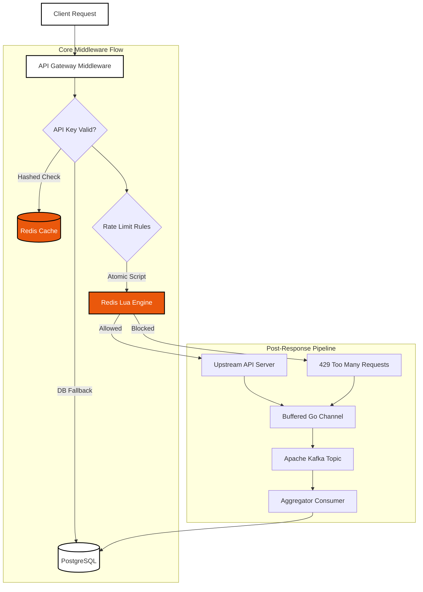
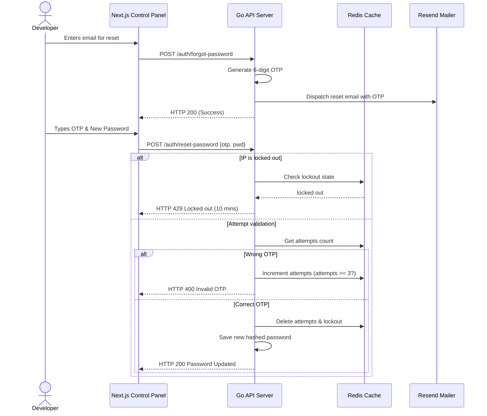

# Limiter.io — Distributed API Rate Limiting Platform

<div align="center">
  
  
  
  
  
</div>

---

### 📖 Platform Overview
A production-grade, highly scalable distributed API Rate Limiting Platform built in Go and Next.js. Inspired by Cloudflare Rate Limiting and Upstash, **Limiter.io** enforces fine-grained API throttling at sub-millisecond speeds.

> [!NOTE]  
> Authentication states (API keys) and project subscriptions are cached in Redis. The middleware makes rate-limiting decisions without hitting PostgreSQL.

---

##  System Architecture



---

##  Key Features

*   **Sub-Millisecond Decisions**: Powered by GORM + GORM Cache + Redis preloaded Lua scripts.
*   **🧩 5 Algorithmic Engines**:
    *   **Token Bucket** (Absorbs short bursts cleanly)
    *   **Fixed Window** (Standard rate counts per epoch)
    *   **Sliding Window Counter** (Blends current & previous window for smooth rates)
    *   **Sliding Window Log** (Exact timestamps, high accuracy)
    *   **Leaky Bucket** (Drips queued requests at a constant interval)
*   ** Hardened OTP & Security**:
    *   6-digit numeric secure OTP codes for password resets.
    *   **Brute-Force Guard**: Maximum of 3 attempts before locking the IP address out for 10 minutes.
    *   Cloudflare Turnstile CAPTCHA integration out of the box.
*   ** Observability Stack**: Exposes structured JSON logging via Uber's `zap` and records Prometheus metrics.

---

## Repository Structure

```text
├── cmd/
│   ├── api/            # API Server entrypoint
│   └── consumer/       # Kafka background aggregator consumer
├── internal/
│   ├── config/         # Environment configurations (Viper)
│   ├── database/       # Postgres connections and seeding
│   ├── delivery/http/  # Gin routing initialization
│   ├── dto/            # Data Transfer Objects
│   ├── handlers/       # Gin HTTP controllers
│   ├── mailer/         # Resend transactional email client
│   ├── middleware/     # Auth, Recovery, Log, Metrics & Rate Limiting middlewares
│   ├── models/         # GORM database schemas
│   ├── ratelimiter/    # Rate Limiting interface and Redis implementations
│   ├── redis/          # Redis connection pool and preloaded Lua scripts
│   ├── repository/     # Interfaces and GORM/Redis concrete implementations
│   ├── services/       # Core business logic layer
│   └── utils/          # Cryptographic hashing & OTP generation
├── deploy/
│   ├── docker/         # Dockerfile & Docker-Compose stack
│   └── kubernetes/     # Deployments, Services, ConfigMaps, Secrets, Ingress & HPAs
└── landing/            # Next.js 16 Brutalist Control Panel Dashboard
```

---

## OTP Authentication & Password Reset Flow



---

## Quick Start (Local Development)

### 1. Set up Environment Configuration
Copy the configuration template:
```bash
cp .env.example .env
```

Make sure to configure the Turnstile and Resend keys in your `.env`:
```env
NEXT_PUBLIC_TURNSTILE_SITE_KEY=0x4AAAAAAD1x7YKuBe2GASeK
TURNSTILE_SECRET_KEY=0x4AAAAAAD1x7azRPzq8LdTJ-Fhv3AvF3rg
RESEND_API_KEY=your_resend_api_key
```

### 2. Launch Services
Deploy the infrastructure stack (Postgres, Redis, Kafka, API, Consumer, Next.js Landing) using Docker Compose:
```bash
docker-compose -f deploy/docker/docker-compose.yml up --build -d
```

### 3. Service Endpoints
*   **Next.js Dashboard**: `http://localhost:3000`
*   **Go API Server**: `http://localhost:8080`
*   **Swagger API Docs**: `http://localhost:8080/swagger/index.html`
*   **Prometheus Metrics**: `http://localhost:9090`
*   **Liveness Probes**: `GET http://localhost:8080/healthz`
*   **Readiness Probes**: `GET http://localhost:8080/readyz`

---

## Core APIs

| Method | Route | Description | Auth |
| :--- | :--- | :--- | :--- |
| `POST` | `/api/v1/auth/register` | Register operator profile | No |
| `POST` | `/api/v1/auth/login` | Authenticate and issue JWT tokens | No |
| `POST` | `/api/v1/auth/forgot-password` | Send 6-digit OTP reset code | No |
| `POST` | `/api/v1/auth/reset-password` | Validate OTP and set new password | No |
| `POST` | `/api/v1/auth/logout` | Revoke user access & refresh tokens | Yes |
| `POST` | `/api/v1/projects` | Provision new rate-limiting project | Yes |
| `GET` | `/api/v1/projects` | List all projects owned by user | Yes |
| `POST` | `/api/v1/projects/:id/keys` | Create an API Key (returned *once*) | Yes |
| `POST` | `/api/v1/projects/:id/rules` | Add matching route rate limit rule | Yes |
| `GET` | `/api/v1/projects/:id/analytics/stats`| Fetch request counts & latency periods | Yes |

---

## Subscription Plans

| Property | Free Plan | Pro Plan | Enterprise Plan |
| :--- | :--- | :--- | :--- |
| **Max Projects** | 3 | Unlimited | Unlimited |
| **Max Keys per Project**| 3 | Unlimited | Unlimited |
| **Available Algorithms**| Token Bucket | Token, Fixed, Sliding Windows, Leaky | All algorithms |
| **Retention Window** | 7 Days | 90 Days | 365 Days |
| **Max Requests** | 100/minute | 10,000/minute | 1,000,000/minute |
