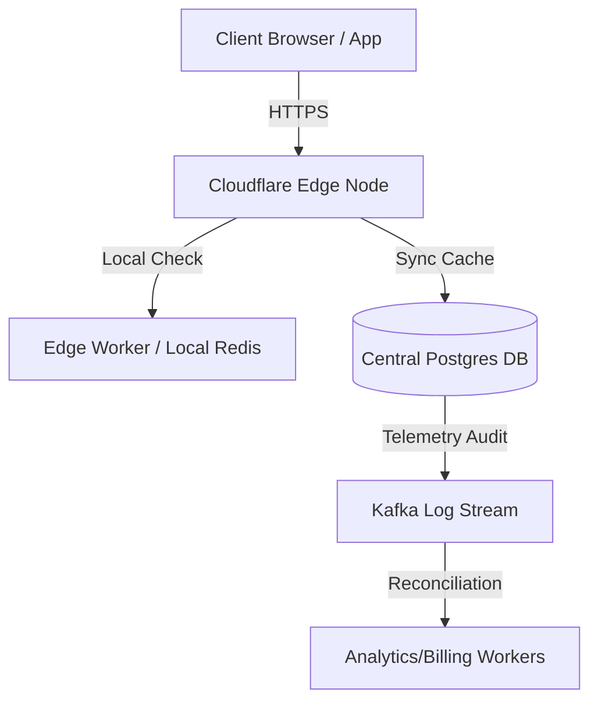

# Production Checklist & Future Architecture Guide

This document describes how the current rate limiter is structured, how to activate the Lemon Squeezy checkout, and what features are required to make this platform commercially ready at scale.

---

## 🍋 1. Lemon Squeezy Billing Integration

The checkout integration is completely wired and handles subscription webhooks. To configure it:

### Setup Steps
1. **Create Checkout in Lemon Squeezy**: 
   Setup a Product (e.g., "Pro Plan") in your Lemon Squeezy Dashboard and create a checkout link.
2. **Add Env Variables**:
   Add these to your Next.js `.env.local` configuration:
   ```env
   NEXT_PUBLIC_LEMONSQUEEZY_CHECKOUT_URL="https://your-store.lemonsqueezy.com/checkout/buy/your-id"
   ```
   Add these to your Go backend configuration:
   ```env
   LEMONSQUEEZY_WEBHOOK_SECRET="your_shared_webhook_secret_key"
   LEMONSQUEEZY_PRO_VARIANT_ID="variant_id_of_your_pro_plan"
   ```
3. **Configure Webhook Callback**:
   Point the Lemon Squeezy Webhook configuration to:
   `https://api.yourdomain.com/api/v1/billing/webhook`
   Ensure the webhook listens for the `subscription_created` event.

### Webhook Flow
When a user clicks **Upgrade**, they are sent to Lemon Squeezy with their email prefilled. After payment, Lemon Squeezy sends a signed HMAC-SHA256 webhook to the Go backend. The backend validates the signature, audits the event, looks up the user by email, and upgrades them to the Pro plan.

---

## 📦 2. Designing Client SDKs

For developers to use your rate limiter, they should not have to write custom HTTP requests. They need official SDKs (e.g. JavaScript, Go, Python).

### Key Features of a Production SDK
- **Local In-Memory Cache (Hybrid Limits)**: 
  To avoid hitting the central Go rate limiter gateway on *every single request* (which adds latency), the SDK should caches results locally for a brief window (e.g. 1-2 seconds) using a local Token Bucket or TTL cache.
- **Fail-Open Policy (Fallback)**:
  If the rate-limiter gateway goes down or times out, the SDK should "fail-open" (permit the request) rather than blocking client traffic. It should log a fallback event and report it to the client.
- **Asynchronous Telemetry Reporting**:
  Instead of calling the gateway blocking-ly, the SDK can batch request telemetry in the background and send reports asynchronously to the Go gateway.

### Example SDK usage (JS / TypeScript)
```typescript
import { RateLimiterClient } from "@limiter/sdk-node";

const limiter = new RateLimiterClient({
  apiKey: "lim_live_abcdef123456",
  fallbackPolicy: "allow", // fail-open
  localCacheTtlMs: 1000    // cache limits locally for 1s
});

async function handleApiRequest(req, res) {
  const check = await limiter.allow("user-profile-route", {
    keyStrategy: "ip",
    ip: req.ip
  });

  if (!check.allowed) {
    res.status(429).send("Rate limit exceeded. Try again in " + check.retryAfter + "s");
    return;
  }
  
  // Proceed with request
}
```

---

## 🚀 3. Scale & Production Roadmap (What is Left?)

To run this as a high-availability commercial platform, implement these production enhancements:



### 1. Edge-Route Rate Limiting (Low Latency)
- **Problem**: Right now, all traffic must hit your Go backend API gateway to evaluate rate limits, adding network latency for international clients.
- **Solution**: Run rate limit evaluations directly at edge nodes (e.g., using Cloudflare Workers or Vercel Edge Functions). These workers check local Upstash Redis or memory caches first, sync in the background, and provide sub-10ms response times.

### 2. Multi-Tier Fallback Strategies
- **Problem**: If Redis crashes, your backend falls back to allowing requests, but cannot track quotas.
- **Solution**: Set up a secondary cache database (e.g. Memcached or secondary Redis replica) that the middleware can immediately switch to in write-through mode.

### 3. Usage Alerts & Notifications
- **Goal**: Email/Slack notifications when quota limits are reached.
- **Implementation**:
  - Add a rule threshold trigger table in GORM.
  - Set up a background cron/worker to check user limits daily.
  - Send transactional emails (e.g. via Resend or SendGrid) when usage hits 80% or 100%.

### 4. Advanced Rate-Limit Algorithms
- **Dynamic Throttle**: Throttles user traffic dynamically based on current server CPU load or DB connection pool utilization.
- **Concurrency Limiting**: Limit the number of concurrent connections (e.g., maximum 5 open files/requests per user at the same time).
